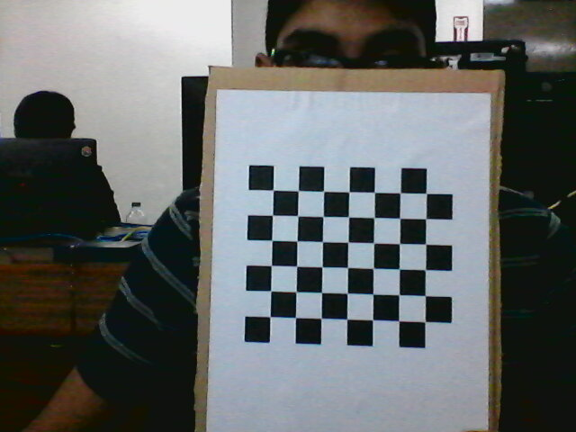
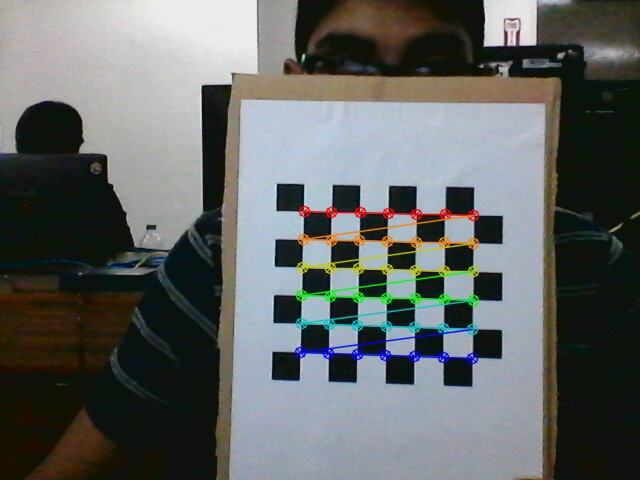
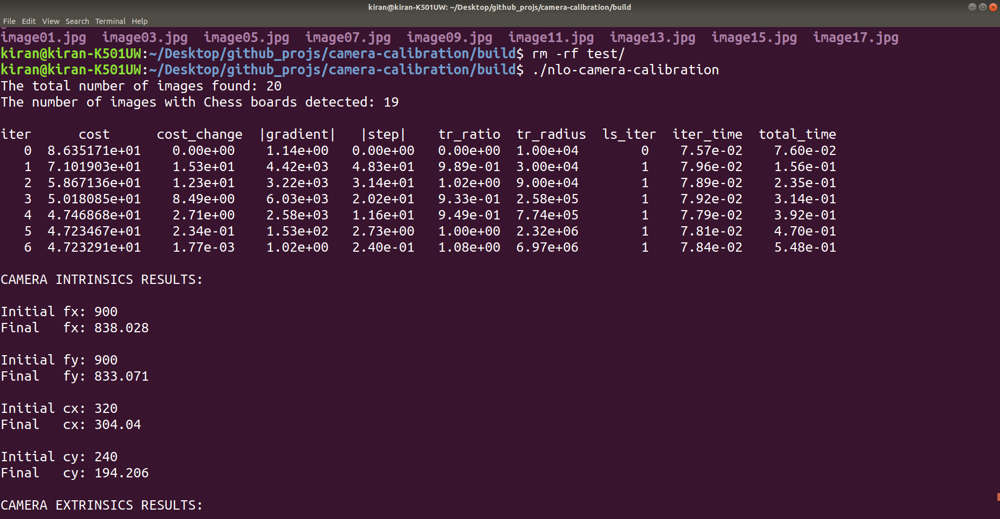

# Ceres & OpenCV bundle adjustment solution

This project presents a Ceres based solution for estimating a camera's intrinsics. The equations and theory used in code is heavily based on [OpenCV: Camera Calibration and 3D Reconstruction](https://docs.opencv.org/2.4/modules/calib3d/doc/camera_calibration_and_3d_reconstruction.html).

The image on the left shows an example of a raw image used for estimating the camera intrinsics. The right shows the redrawn board points which was computed based on the optimized camera intrinsics.

  
  &nbsp;&nbsp;&nbsp;&nbsp;&nbsp;&nbsp;&nbsp;
  

The image below is a snippet of terminal output. The snippet shows that it took 7 iterations to converge at the final estimate for the camera intrinsics.

    

## Running the code

### Installing Dependencies

Globablly installed [Ceres](http://ceres-solver.org/installation.html#linux) and [OpenCV](https://docs.opencv.org/4.x/d7/d9f/tutorial_linux_install.html) libraries are used in this project. Specify the PATH variable in [CMakeLists.txt](CMakeLists.txt) if a local version is desired to be used. The software versions used are:

- OS: Ubuntu 18.04
- CERES: 2.1.0
- OpenCV: 3.2.0

### Building & Compiling

Generate the build files by running the top level CMakeList.txt within the build directory:
`cd build && cmake ..`

Compile the executable within the build directory: `make`

### Running

Execute the generated executable: `./nlo-camera-calibration`

The executable uses gflags which are documented in the source code.

- Defaults are set to use my images to demonstrate out of box functionality.
- In summary, the parameters which can be changed are:
  - Initial estimates
  - Calibration board parameters
  - Read/Write disk options
- gflag example:
  - Write processed images to a specified directory "test": `./nlo-camera-calibration -write_directory=test/`
